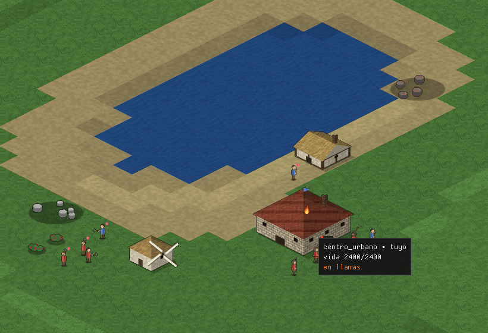

# RTS medieval con capa de logística (nombre provisional)

RTS medieval en C++23, de la escuela de Tzar y Age of Empires II, con una capa de logística opcional modelada como grafo.
Todo el código y todos los recursos son originales o de licencia compatible. No se usa ningún contenido del juego original.

## Estado

| Hito | Contenido | Estado |
|------|-----------|--------|
| M0 | Esqueleto: ventana, paso fijo, ImGui, CMake + vcpkg, CI Windows/Linux | hecho, en revisión |
| M1 | Mapa isométrico por casillas, cámara, selección por rectángulo | hecho, en revisión |
| M2 | Unidades, HPA*, campos de flujo, evitación local, banco de 1000/2000 unidades | hecho |
| M3 | Economía: 4 recursos, aldeanos, construcción, colas de producción | hecho |
| M4 | Combate con proyectiles esquivables, experiencia por unidad y héroes | hecho |
| M7 (adelantado) | IA básica que juega con las mismas reglas que un humano; victoria y derrota | hecho |
| M5 | Repeticiones deterministas: grabación automática, reproductor y verificación | hecho |
| M6 | Logística: víveres, munición, bagaje, convoyes, campamentos y trabuquete | hecho |
| M7 | IA más inteligente (varias dificultades por cómo juega, nunca por trampas) | en curso: percepción con niebla, 18 módulos |
| M8 | Multijugador lockstep | hecho (fase E: sala, charla, 2–4 jugadores, relevo de la IA) |
| F1 | Arte propio generado por código: figuras animadas, edificios, árboles, fuego y humo | hecho |
| F2 | Sonido propio sintetizado: efectos de combate, trabajo y avisos; música modal compuesta por código | hecho |

El plan completo, con lo que falta y en qué orden, está en [docs/PLAN.md](docs/PLAN.md).

## Requisitos

| | Mínimo | Motivo |
|---|---|---|
| CMake | 3.28 | |
| Linux | Ubuntu 24.04, **Clang ≥ 19** o **GCC ≥ 14**, Ninja | Clang 18 no ve `std::expected` en libstdc++ (medido: define `__cpp_concepts = 201907L`, libstdc++ exige `202002L`) |
| Windows | Visual Studio 2022 o posterior (la CI usa VS 2026, MSVC 14.51) con MSVC o clang-cl, Ninja | |
| GPU | Vulkan 1.0 (Linux y Windows) o Direct3D 12 nivel 11_0 (Windows) | Requisitos de SDL_GPU, ver `SDL_gpu.h` |
| vcpkg | cualquier versión reciente, con `VCPKG_ROOT` definido | modo manifiesto, baseline fijado en `vcpkg.json` |

Paquetes de sistema en Ubuntu 24.04:

```sh
sudo apt-get install ninja-build clang-20 g++-14 pkg-config \
  libx11-dev libxext-dev libxrandr-dev libxcursor-dev libxi-dev libxss-dev \
  libxfixes-dev libxtst-dev libwayland-dev libxkbcommon-dev libegl1-mesa-dev \
  libdbus-1-dev libibus-1.0-dev
# opcional, para ejecutar con ventana sin GPU (como la CI): xvfb mesa-vulkan-drivers
```

## Compilar y ejecutar

```sh
cmake --preset linux-clang-debug         # o windows-msvc-debug, windows-clang-cl-debug, linux-gcc-debug
cmake --build --preset linux-clang-debug
ctest --preset linux-clang-debug

./build/linux-clang-debug/src/rts                           # con ventana
./build/linux-clang-debug/src/rts --frames 600              # con ventana, sale tras 600 fotogramas e imprime tiempos
./build/linux-clang-debug/src/rts --headless --ticks 12000  # sin ventana: imprime el hash de estado
./build/linux-clang-debug/src/rts --data <carpeta>          # otra carpeta de datos
./build/linux-clang-debug/src/rts --replay <fichero.rtsrep>        # ver una repetición
./build/linux-clang-debug/src/rts --verify-replay <fichero.rtsrep> # reproducirla sin ventana y comprobar sus hashes
./build/linux-clang-debug/src/rts --headless --ticks 2400 --record r.rtsrep  # grabar el guion sin ventana
```

Cada partida con ventana se graba sola al cerrar en `replays/partida-<fecha>_<hora>.rtsrep`, junto al ejecutable.

Controles:

| Acción | Entrada |
|---|---|
| Desplazar la cámara | Flechas o WASD; ratón en el borde de la ventana |
| Seleccionar | Clic sobre un marcador, o arrastre con el botón izquierdo |
| Añadir a la selección | Mayús + clic o arrastre |
| Vaciar la selección | Esc |
| Mover la selección | Clic derecho sobre el destino |
| Recoger un recurso | Clic derecho sobre el nodo (árbol, arbusto, mina) con aldeanos seleccionados |
| Construir o descargar | Clic derecho sobre un edificio propio: si está en obra, se construye; si es almacén, se descarga |
| Colocar un edificio | Botón del panel «Selección» con aldeanos seleccionados; clic para colocar, Mayús + clic para varios, clic derecho o Esc para cancelar |
| Producir unidades | Clic sobre un edificio propio y botones de su panel; «Cancelar la última» devuelve el coste entero |
| Atacar | Clic derecho sobre una unidad o un edificio enemigo |
| Ataque-movimiento | Ctrl + clic derecho sobre el destino: van peleando con lo que encuentren |
| Postura | Botones «Agresiva» y «Mantener posición» del panel «Selección» |
| Repetición: pausa y velocidad | Espacio; teclas 1-4 para x1, x2, x4 y x8 (o el panel «Repetición») |

Cada preset tiene su versión `-release` (RelWithDebInfo). Opciones de CMake: `RTS_WERROR` (ON), `RTS_TRACY` (OFF) y `RTS_BUILD_TESTS` (ON).

## Arquitectura

```
src/sim/       simulación pura: sin SDL, sin E/S, sin coma flotante
src/render/    presentación: lee snapshots e interpola
src/platform/  ventana, entrada, reloj, perfilado
src/game/      pegamento: bucle, configuración, arranque
src/render/shaders/  HLSL: dxc lo compila a SPIR-V (Vulkan) y DXIL (D3D12) y se empaqueta en el binario
src/tools/     editor de mapas (pendiente)
data/          TOML de diseño; se copia junto al ejecutable
tests/         doctest + pruebas de CTest
```

Grafo de bibliotecas (las flechas solo bajan):

```
rts ─┬─ rts_render ─┬─ rts_platform ── SDL3
     │              ├─ imgui, shaders (dxc)
     │              └─ rts_render_core     proyección, atlas, escena: sin SDL, se prueba sin GPU
     ├─ rts_game_core ── toml++, rts_render_core   cámara, selección, configuración
     └─ rts_sim ── EnTT                    sin SDL, sin E/S, sin coma flotante
```

`rts_sim` no enlaza SDL, así que un `#include <SDL3/...>` en `src/sim/` no compila.

### Render (M1)

- **Proyección isométrica 2:1.** La casilla (i, j) tiene su esquina superior en ((i−j)·w/2, (i+j)·h/2) píxeles del mundo.
- **Recorte.** `for_each_visible_tile` recorre la pantalla por filas r = i + j, así que visita solo las casillas visibles y ya en orden de pintado. A 1920×1080 son 2104 casillas de 65 536 (medido en `test_projection`).
- **Un solo draw call.**
  - Cada sprite es una instancia de 28 B (posición, tamaño, UV en 16 bits, color RGBA8).
  - El vertex shader genera el quad a partir de `SV_VertexID`.
  - Todo el lote se sube por un búfer de transferencia que SDL recicla (`cycle = true`) y se dibuja con `SDL_DrawGPUPrimitives(6, N)`.
- **Atlas generado por código.** Mientras no haya arte propio es un rombo, un disco, un anillo y un bloque sólido, todos en blanco; el color de la instancia los tiñe. Con casillas de 64×32 el atlas ocupa 128×128 RGBA8 (64 KiB).
- **El mapa no se copia por tick.** El `Snapshot` comparte el `TileMap` por `shared_ptr<const>`. El render recalcula los colores por casilla (256 KiB) solo cuando cambia `TileMap::revision()`.

### Las tres reglas duras y cómo se hacen cumplir

1. **Simulación y presentación separadas.** La simulación escribe un `Snapshot` por tick y el render interpola entre los dos últimos con `alpha ∈ [0, 1)`. El render nunca toca el `entt::registry`.
2. **Determinismo.**
   - Toda la simulación usa `Fixed` (16.16 sobre `int32_t`) y enteros.
   - La aleatoriedad sale de xoshiro256++, con semilla explícita que se expande con splitmix64.
   - La prueba de CTest `sim_purity` falla si en `src/sim/` aparece `float`, `double`, `<cmath>`, `<chrono>`, `<random>`, `unordered_*`, E/S o SDL.
   - La CI compila con cuatro compiladores (MSVC, clang-cl, Clang 20 y GCC 14) y exige el mismo hash de estado en los cuatro.
3. **Paso fijo a 20 Hz.**
   - El tick dura exactamente 50 000 000 ns.
   - El reloj acumula nanosegundos enteros y ejecuta como mucho `loop.max_ticks_per_frame` ticks por fotograma. El retraso que sobre se descarta para evitar la espiral de la muerte.

### Movimiento (M2)

- **Órdenes.** `sim::Command{tick, jugador, tipo, unidades, destino}` se encola con `World::issue` y se aplica al inicio del tick indicado, en orden de llegada. Es la unidad que grabarán las repeticiones (M5) y que viajará en lockstep (M8).
- **Rejilla.**
  - 8 direcciones con coste entero octil: 10 en recto, 14 en diagonal.
  - Prohibido atajar esquinas bloqueadas.
  - Las componentes conexas precalculadas descartan al instante los destinos inalcanzables, que se sustituyen por la casilla alcanzable más cercana.
- **HPA\*.**
  - Sectores de 16×16, con portales en los tramos abiertos de cada borde (como mucho 8 casillas por portal) y aristas internas precalculadas con Dijkstra acotado al sector.
  - Una consulta es un A\* sobre el grafo abstracto (1626 nodos y 11 390 aristas en el mapa por defecto), más un refinado perezoso tramo a tramo.
  - Medido frente a A\* óptimo en 200 rutas: 3,6 % más largas de media y 15,7 % en el peor caso.
- **Presupuesto determinista.** El planificador expande como mucho `path_node_budget_per_tick` nodos por tick. Se mide en nodos, no en milisegundos, para que el reparto sea idéntico en todas las máquinas.
- **Campos de flujo.**
  - Una orden a 8 o más unidades usa un único Dijkstra desde el destino, limitado al pasillo de sectores del camino abstracto.
  - Cada unidad tiene su hueco de llegada: su desplazamiento respecto al centroide del grupo, comprimido al radio de un racimo compacto (el "magic box" de StarCraft).
- **Evitación local "RVO muestreado".**
  - Rejilla espacial por ordenación por conteo y hasta 8 vecinas a menos de 2 casillas.
  - 18 velocidades candidatas, puntuadas por desvío más el riesgo de colisión en 20 ticks, con velocidad relativa recíproca `2v' − vᵢ − vⱼ`.
  - La separación de solapamientos es de tipo Jacobi, así que no depende del orden de las unidades.
- **Llegada.**
  - En el radio del destino.
  - En cadena, al tocar a una compañera ya llegada dentro del radio esperado del racimo.
  - Por atasco, tras `stuck_arrive_ticks` casi parada.
  - Las llegadas quedan quietas y son obstáculos para las demás.
- **Sin coma flotante.** Todo el movimiento usa `Fixed` y enteros; la raíz cuadrada es entera (`isqrt`). El mismo hash tras 1200 ticks de movimiento con Clang 20 y GCC 14.

### Economía (M3)

- **Jugadores.** `PlayerState` guarda las existencias de los 5 recursos (comida, madera, piedra, oro y hierro), la población y el tope, todo en enteros. Cada unidad y cada edificio llevan un `Owner`. Una orden sobre entidades de otro jugador se ignora.
- **Objetos estáticos.**
  - Los nodos de recurso (árbol, arbusto, minas de 2×2) y los edificios son entidades con una huella (`Footprint`).
  - La huella bloquea sus casillas en una capa de ocupación de `PassGrid`. El `TileMap` del terreno no cambia nunca, así que los snapshots lo siguen compartiendo sin copiarlo.
- **Pathfinding incremental.** Los cambios de ocupación de un tick se aplican juntos:
  - Se reetiquetan las componentes conexas.
  - Se vuelven a detectar los portales de todos los bordes, que es barato.
  - Los Dijkstra internos se repiten solo en los sectores sucios o en los que cambió su conjunto de nodos.
  - El grafo resultante es idéntico, nodo a nodo y arista a arista, al construido desde cero. En la prueba con 12 rondas de 4 cambios se recalculan 64 sectores de 3072.
  - Se rehacen los campos de flujo cuyo pasillo toca un sector cambiado y se replanifican los caminos que ahora cruzan una casilla bloqueada.
- **Ciclo del aldeano** (componente `Worker`):
  - Va al nodo y recoge una unidad cada `gather_ticks`. Con `carry_capacity` encima, va al almacén propio más cercano que acepte ese recurso, descarga y vuelve.
  - Si el nodo se agota, busca otro del mismo recurso a menos de `retarget_radius_tiles`. Tiene que ser accesible (con una casilla vecina en su componente) y tener sitio: `gatherers_per_tile` aldeanos por casilla de huella.
  - Si cambia de recurso, pierde lo que llevaba.
- **Acercarse a un objeto.**
  - El aldeano va a la casilla de acceso del primer anillo más cercana dentro de su componente.
  - Está al alcance cuando el borde de su disco queda a `interact_range` del borde de la huella.
  - Tras `approach_attempts` intentos sin llegar, cambia de objetivo.
- **Edificios.**
  - Se cobran al colocarlos. La casilla debe tener terreno transitable, sin objetos y sin unidades encima.
  - Cada aldeano al alcance aporta un tick de trabajo por tick, así que la obra crece linealmente con el número de aldeanos. Medido: una casa de 300 ticks tarda 300 ticks con 1 aldeano y 100 con 3.
- **Colas de producción.**
  - Caben `queue_capacity` unidades. Se cobran al encolar y cancelar la última devuelve el coste entero.
  - Sin plazas de población la cola se detiene sin perder nada.
  - La unidad nueva aparece en una casilla libre alrededor del edificio, repartida entre las del primer anillo que tenga sitio.
- **Preparación de partida** (`[setup]` y `[[player]]` en `engine.toml`, RNG propio con `setup.seed`):
  - El edificio inicial va al sitio válido más cercano al pedido, en una región de al menos `min_start_region_tiles` casillas.
  - Alrededor se colocan los recursos garantizados.
  - Los bosques se pueblan de árboles con la densidad pedida, dejando un claro alrededor de cada inicio.
  - Cada jugador recibe sus aldeanos iniciales.
- **Interfaz.**
  - Barra de recursos y población.
  - Con aldeanos seleccionados, menú de construcción con un fantasma verde o rojo.
  - Con un edificio seleccionado, su cola de producción.
  - Clic derecho contextual.
  - Los marcadores llevan un anillo con el color del jugador y un punto con el color del recurso que cargan.
- **Pendiente, a sabiendas:**
  - Punto de reunión, granjas, derribo y reparación.
  - Nada garantiza que un recurso no quede encerrado por el bosque.
  - La construcción es lineal; el género suele dar rendimientos decrecientes.

### Combate (M4)

- **Estadísticas por tipo** (`units.toml`): vida, ataque y armadura de cuerpo a cuerpo y de proyectil, clase de armadura, daño extra contra clases, alcance entre bordes, recarga, radio de visión y velocidad del proyectil. Los edificios tienen armadura y clase en `buildings.toml`.
- **Daño por golpe**, estilo del género:
  `max(1, max(0, cuerpo − armadura_cuerpo) + max(0, proyectil − armadura_proyectil) + bonus[clase])`.
- **Resolución simultánea.** Todos los golpes de un tick se calculan sobre el estado del principio del tick, se suman y se aplican de una vez; las muertes, al final. Dos unidades iguales que se atacan mueren en el mismo tick (prueba incluida).
- **Proyectiles esquivables.** Son entidades que vuelan hacia donde estaba el blanco al disparar. Al caer, dañan al blanco previsto si sigue ahí; si no, a la unidad enemiga más cercana en ese punto o al edificio enemigo de la casilla. Si no hay nadie, fallan. Una unidad que cruza la línea de tiro esquiva la flecha (prueba incluida).
- **Blancos.**
  - Orden de ataque explícita.
  - Adquisición automática del enemigo más cercano dentro de la visión, cada `acquire_interval_ticks` repartidos por id, con una rejilla espacial propia del tick.
  - Persecución que se recalcula si el blanco se aleja `repath_tiles`, y abandono tras `chase_attempts` llegadas sin alcanzarlo.
  - Posturas: agresiva, o mantener posición (no persigue).
  - Ataque-movimiento: un movimiento de grupo que se desvía para pelear y luego sigue.
- **Experiencia al estilo Tzar.**
  - 1 punto por punto de daño hecho, más `xp_kill_bonus` por baja.
  - 12 niveles con umbrales en TOML. Cada nivel da un porcentaje de vida y de ataque, y armadura cada pocos niveles.
  - En el último nivel la unidad se vuelve héroe: nombre propio y aura de ataque para los aliados cercanos. Las auras no se acumulan.
- **Muerte.** La entidad se destruye. Un edificio libera su huella con la actualización incremental de M3 (prueba: el grafo queda igual que uno construido desde cero).
- **Presentación.** Barras de vida, proyectiles en vuelo, anillo dorado de héroe, nivel y experiencia en el panel.

### IA básica (adelanto de M7)

- **Dentro de la simulación.** Es determinista, corre igual en todas las máquinas y en red no habrá que enviar sus órdenes. Solo lee el estado y emite las mismas órdenes que un humano, que se validan igual.
- **Sin trampas.** No recibe recursos ni ventajas; paga lo mismo que el jugador (prueba: sus existencias nunca bajan de cero). Las dificultades futuras saldrán de jugar mejor, no de hacer trampas.
- **Qué hace** (una vez por segundo, `[ai]` en `engine.toml`):
  - Entrena aldeanos hasta su objetivo y los reparte entre recursos según porcentajes, solo entre los que quedan en el mapa.
  - Construye casas antes de quedarse sin plazas, el cuartel a partir de cierto número de aldeanos, granjas cuando no le queda comida natural cerca y almacenes junto a recursos lejanos.
  - Entrena en el cuartel la primera unidad de su ciclo que pueda pagar.
  - Ataca con ataque-movimiento cuando reúne una oleada (cada una mayor) y defiende su base: saca el ejército y refugia a los aldeanos amenazados.
- **Granjas.** Un edificio que, terminado, da comida a su dueño hasta agotarse; la comida natural no dura toda la partida.
- **Victoria y derrota.** Pierde quien se queda sin ningún edificio vital terminado (`vital = true` en `buildings.toml`: el centro urbano) después de haber tenido alguno; uno en obra no cuenta. Un jugador que nunca tuvo uno (pruebas, demo) pierde al quedarse sin unidades ni edificios. La derrota es definitiva y lo que le quede al perdedor se retira del mapa. `ataque_fuerza` apunta primero al edificio vital enemigo más cercano. La pantalla muestra el resultado.
- **Configuración.** En `engine.toml`, cada jugador lleva `controller = "humano"` o `"ia"`; por defecto juegas tú (jugador 0) contra la IA. Un jugador de la IA elige su perfil con `ai_profile`.
- **Módulos y perfiles.** La IA se compone de tres capas:
  - **Percepción:** un resumen de lo que el jugador sabe, rehecho en cada decisión. Es el único sitio que lee el mundo; cuando haya niebla de guerra, filtrará con la misma visibilidad que un humano.
  - **Módulos:** `defensa`, `aldeanos`, `casas`, `cuartel`, `granjas`, `almacenes`, `obras`, `recoleccion`, `ejercito` y `ataque`. Comparten el presupuesto de la decisión.
  - **Perfiles** (`[[ai.profile]]`): qué módulos usa, en qué orden y con qué umbrales. Una dificultad nueva es un perfil con más módulos o módulos que piensan mejor; ningún parámetro de un perfil toca la economía ni las reglas.
  - Niveles (D4): `facil` (la IA original), `normal` (por defecto), `dificil` y `experto`, con las mismas reglas y costes. Los separan los módulos que usan y la paciencia. Medido en 40 partidas, `normal` y `dificil` ganan a `facil` el 82 % y `experto` el 90 %. Entre `normal`, `dificil` y `experto` la diferencia aún no es significativa (50 %, 50 %; `experto` contra `normal`, 62 %): los altos juegan más rico (emboscadas, formaciones, sanidad, convoyes, herrería), pero todavía no más fuerte.
  - Logística: restaba (32 % medida aparte) porque el bagaje le quitaba el centro urbano a los aldeanos. Ahora la IA solo entrena bagaje con la aldea completa y el ejército en campaña, y queda neutra (55 %).
- **Qué añade `normal`.** Juega con las mismas reglas y la misma información; solo decide mejor:
  - `ejercito_contra`: entrena el tipo que más rinde contra lo que tiene el rival, por unidad de coste. Contra un ejército, compara cuánto mata por tick con cuánto le matan. Sin unidades armadas enemigas, elige lo que antes derriba sus edificios. Todo sale de la fórmula de daño y de los datos.
  - `ataque_fuerza`: ataca cuando la fuerza estimada de su ejército (vida × daño por tick) llega al 130 % de la enemiga conocida, y se retira si en la batalla baja del 60 %. Esa histéresis evita que oscile entre atacar y retirarse.
  - `concentrar`: cada unidad que pelea remata al enemigo armado que necesita menos golpes suyos. Los aldeanos enemigos no son prioridad: primero, lo que amenaza al ejército.
  - Economía: dos aldeanos en cola y casas con más margen.
- **Medido** con `rts_ai_match`, 40 partidas de 30 minutos (20 semillas con los lados cambiados): `normal` gana a `facil` 33 de 40 (82 %) y `experto` 36 de 40 (90 %). Casi todas se deciden a los puntos (valor vivo de unidades y edificios): rematar exige asedio.

### Arte propio (F1)



Ningún píxel viene de fuera: todo se pinta por código al arrancar (62 ms en Release, en un atlas de 1024×1024).

- **Primitivas.** Las piezas son círculos, cápsulas (segmentos con radio) y polígonos. Se suavizan por cobertura o por submuestreo 4×4 y se sombrean con luz de arriba a la izquierda. Llevan un contorno oscuro de un píxel y una sombra en el suelo. El ruido de los materiales es determinista, así que el mismo arte da los mismos píxeles en todas las máquinas.
- **Qué se pinta.** `data/art.toml` describe cada tipo con unas pocas palabras: su silueta, su arma, su casco, su armadura y sus colores. El parser exige arte para cada tipo de los catálogos y rechaza nombres que no existen o repetidos.
  - **Figuras:** persona, jinete, acémila, carreta, ariete y trabuquete.
  - **Edificios:**
    - Formas: bloque, campo, camino, muro, torre, tiendas, puestos y molino.
    - Tejados: dos aguas, cuatro aguas, almenas, estacas, cónico.
    - Materiales: piedra, madera, enlucido con entramado, paja, teja, lona, tierra.
  - **Recursos:** árbol (uno de cada tres, pino), arbusto, rocas, vetas, escombros.
  - **Terreno:** hierba, agua, arena, roca, tierra, en 4 variantes por casilla.
- **Color del jugador.**
  - Cada sprite tiene dos capas. El cuerpo lleva sus colores; la capa del jugador va en grises y se tiñe al dibujar.
  - Esa capa cubre túnicas, gualdrapas, mantas, lonas, toldos y estandartes.
  - Lo que tapa la tela, como un brazo o un escudo, la borra de esa capa. Así, una capa sobre otra da la figura correcta sin pintar una versión por jugador.
- **Animación.**
  - Hay cinco poses: quieto, dos pasos, preparar y golpear.
  - Andando, las figuras siguen un ciclo de pasos. Combatiendo, la pose depende de cuánto falta para el siguiente golpe (la simulación expone el blanco y la recarga). Trabajando, dan golpes de herramienta.
  - Cada unidad va desfasada de las demás, mira hacia donde anda o hacia su blanco, y hacia la izquierda se dibuja en espejo.
- **Orden de pintado.**
  - Lo que está a ras de suelo va primero: terreno, campos y caminos.
  - Lo que tiene altura (edificios, árboles y figuras) se ordena por la `y` en pantalla de su punto más adelantado. Así, lo de delante tapa a lo de detrás.
  - Las barras de vida van encima de todo.
- **Obras y fuego.**
  - Un edificio en obra enseña su parte de abajo, que crece con el trabajo. El fantasma de colocación es el edificio mismo, translúcido, en verde o rojo.
  - Un edificio en llamas lleva llamas animadas, más cuanto más arde, y bocanadas de humo que suben, crecen y se deshacen.
  - Todo eso es reloj de la presentación, no de la simulación.
- **Ver el arte entero.** `rts_art_sheet --data data --out hoja.pam` lo pinta todo en una hoja (PAM de Netpbm; `convert hoja.pam hoja.png`). Esta es [docs/arte.png](docs/arte.png).
- **Límites conocidos.**
  - Solo hay dos sentidos (derecha e izquierda en espejo), no ocho.
  - No hay animación de muerte.
  - Los proyectiles siguen siendo puntos.
  - Las repeticiones grabadas antes de que existiera `art.toml` se ven con los marcadores planos de antes.

### Sonido propio (F2)

Ningún sonido se graba ni se carga: todo se sintetiza al abrir la ventana desde `data/sound.toml`. Los efectos están en 15 ms; la música, unos 300 ms, en otro hilo, y entra en cuanto está.

- **Efectos.**
  - Cada sonido es una suma de capas. Cada capa es un oscilador (seno, triángulo, cuadrada, sierra o ruido) con el tono deslizándose, una envolvente (subida lineal y caída exponencial hasta −60 dB), filtros paso bajo y paso alto, vibrato y golpes repetidos.
  - Hay 15 efectos: espada (parciales inarmónicos que se apagan), golpe sordo, cuerda de arco, flecha que se clava, ariete, caída, derrumbe, crepitar de fuego, hacha, pico, martillo, cuerno de aviso, unidad lista, edificio terminado y orden recibida.
  - Cada uno se sintetiza en varias versiones con el tono algo cambiado, que se van turnando para que no suene clonado.
- **Música.**
  - Piezas propias, compuestas por un generador con semilla, en dos modos medievales: dórico (paz) y frigio (batalla).
  - Una flauta (seno con armónicos y vibrato tardío) va sobre un bordón de tónica y quinta, con tamboril.
  - La forma es A A B A, en frases de cuatro compases que cierran en la tónica.
  - El bordón tiene ciclos enteros por vuelta, así que la pieza se repite sin salto.
  - La música de batalla entra cuando hay combate a la vista y la de paz vuelve tras 15 s sin él, con fundido de 3 s.
- **Qué suena.** Un director de sonido traduce lo que pasa en sonidos:
  - golpes (filo, golpe sordo, flecha o asedio, según quién golpea) y disparos;
  - bajas y derrumbes;
  - obras terminadas propias, avisos, órdenes, golpes de herramienta (hacha, pico o martillo, según la tarea) y fuego.
  - Para dar esos golpes y disparos, la simulación expone en el snapshot los de cada tick, sin tocar el hash.
- **Dónde se oye.**
  - Solo suena lo que el jugador ve: la niebla también calla.
  - Lo que está en pantalla suena a plena voz y con panorama de igual potencia según su `x`. Lo que está fuera se oye cada vez más bajo hasta 200 px del borde.
  - Cada sonido tiene una espera mínima entre dos veces seguidas, para que cien espadas no suenen cien veces.
  - Hay 24 voces como mucho: una nueva sustituye a la más débil.
- **Salida.**
  - SDL3 sin hilos propios: cada fotograma se mezclan las muestras justas para mantener 60 ms en cola.
  - Sin dispositivo de audio, como en la CI, el juego sigue en silencio.
- **Oírlo sin jugar.** `rts_sound_wav --data data --out sonidos` escribe cada efecto y cada pieza en WAV.
- **Límite conocido.**
  - No hay sonidos de ambiente (viento, pájaros, agua).
  - El volumen solo se cambia en `sound.toml`; las opciones en pantalla son de F5.

### Mapas: ríos con vados, de 2 a 4 jugadores y editor de escenarios (F3)

- **Tipos de mapa.**
  - En el menú se elige el mapa:
    - «Continental», el de siempre: lagos y continentes por ruido.
    - «Ríos»: dos ríos, uno de arriba abajo y otro de lado a lado.
    - «Gran río»: uno solo, ancho y con más vados.
  - Viajan en los ajustes de la partida (`map = "Ríos"`), así que las repeticiones y las partidas en red los llevan.
  - Cada tipo cambia solo lo que dice (`[[map.preset]]` en `engine.toml`). Con el mapa por defecto no se toca ni el generador aleatorio: el hash es el de siempre.
- **Ríos.**
  - Van de un borde al opuesto, con meandros (en cada paso, un 35 % de probabilidad de desviarse una casilla, sin alejarse del eje más de un octavo del mapa).
  - Se prueban hasta 16 trazados y se queda el primero que pasa a más de 40 casillas de todos los inicios.
- **Vados.**
  - El terreno nuevo «vado» es agua somera: se cruza, despacio (45 %) y sin poder cargar.
  - Un río solo separa tierra donde hay tierra en las dos orillas. En cada uno de esos tramos va al menos un vado, más si es largo, según la densidad pedida. Así el río nunca aísla lo que el terreno dejaba unido.
  - Las orillas de cada vado quedan despejadas 3 casillas (pradera, sin bosque).
- **De 2 a 4 jugadores, todos se alcanzan.**
  - El edificio inicial se busca en la región de tierra más grande del mapa, que es una sola. Antes bastaba con una región «grande», y un lago podía dejar a un jugador en una isla.
  - Si aun así el bosque corta el paso entre dos inicios, se talan los árboles del camino más corto por terreno transitable. Nunca se quita una mina ni unas bayas.
  - Medido en 270 combinaciones (3 tipos de mapa, 30 semillas, 2, 3 y 4 jugadores): todos los inicios se alcanzan por tierra en todas.
- **Editor de escenarios.**
  - En el menú, «Nuevo escenario con este mapa» abre el editor sobre el mapa generado con los ajustes de arriba: semilla, tipo de mapa y jugadores.
  - El editor es la misma vista del juego, sin simulación ni niebla. Sus herramientas:
    - pintar terreno con pincel de 1 a 8 casillas, arrastrando;
    - subir (botón izquierdo) y bajar (derecho) la altura;
    - colocar recursos, edificios y unidades de cada jugador, con el edificio fantasma donde va;
    - borrar, también con el botón derecho;
    - elegir de 1 a 4 jugadores, guardar y probar.
  - El mundo se rehace al soltar el pincel o tras cada cambio (unos 65 ms en Release). Mientras se arrastra, el trazo se ve teñido.
  - Los escenarios se guardan en `escenarios/` junto al ejecutable. Es un TOML legible: el terreno y la altura van con una letra o un dígito por casilla, y debajo la lista de objetos.
  - Desde el menú se juegan o se editan. Al jugar, el escenario viaja con los datos de la partida (`config/escenario.toml`), así que la repetición y la partida en red lo llevan dentro.
- **Límite conocido.**
  - Se puede construir sobre un vado.
  - La IA cruza los vados como cualquier terreno, sin planear dónde defenderlos.
  - El editor no tiene deshacer.
  - Un escenario no lleva aún objetivos ni sucesos (eso es la campaña, F4).

### Repeticiones (M5)

- **Qué se graba.** Una copia de los ficheros de `data/` (unos 20 KB) y las órdenes humanas, cada una con el tick en que se emitió. La IA vive dentro de la simulación y es determinista: sus órdenes no se graban, se regeneran. Una repetición se reproduce con los datos con que se jugó aunque luego cambien los de `data/`.
- **Comprobación.** Cada 10 s de juego (`[replay]` en `engine.toml`) se graba el hash de estado, y al final el hash final. Al reproducir, el primer hash distinto localiza la divergencia con esa resolución.
- **Formato `.rtsrep`.** Binario little-endian explícito: cabecera, versión del formato, hash de los datos, ficheros, órdenes, checkpoints y una suma FNV-1a de todo. Se rechaza un fichero ajeno, truncado o corrupto, o de otra versión, y el error dice cuál de los casos es.
- **Reproductor.** `rts --replay`: pausa, x1/x2/x4/x8, sin órdenes, con el estado de la verificación en pantalla. No hay retroceso.
- **Límite conocido.** Si cambia el formato de los datos (por ejemplo, los perfiles de IA), las repeticiones anteriores no se pueden cargar y el error dice qué clave falta.
- **Límite conocido.** El fichero no guarda la versión del código. Si cambia la simulación, las repeticiones antiguas divergen y se avisa; no se reproducen mal en silencio.

### Partidas en red (E1)

Lockstep, el esquema de Age of Empires: las máquinas no se mandan el estado, sino las órdenes, y todas simulan lo mismo. Bettner y Terrano lo cuentan así: «the expectation was to run the exact same simulation on each machine, passing each an identical set of commands that were issued by the users at the same time» [1].

- **Turnos.** Un turno dura 4 ticks (200 ms). Una orden dada en el turno *t* se ejecuta al empezar el turno *t* + 2, en el mismo tick en todas las máquinas. Es el retraso del original: «Turns were typically 200 msec in length» y «commands issued during turn 1000 would be scheduled for execution during turn 1002» [1]. Un turno no empieza hasta que han llegado los mensajes de todos (vacíos, si alguien no ha dado órdenes). Los valores están en `[net]` de `engine.toml`.
- **Estrella.** Los invitados hablan solo con el anfitrión, que reenvía a todos lo que recibe. Cada mensaje lleva su jugador, y el anfitrión no deja que nadie hable por otro.
- **Desincronización.** Cada 5 turnos (1 s), el mensaje lleva el hash de estado del tick en que sale. Cada máquina lo compara con el suyo. Si no coinciden, la partida se para y dice en qué tick y con qué jugador. Al final se comparan el tick y el hash finales. En el original, «Any simulation that ran differently was tagged as "out of sync" and the game stopped» [1].
- **Conexión.**
  - Sockets TCP propios (POSIX y Winsock), sin bibliotecas nuevas y siempre no bloqueantes.
  - Tramas con longitud y un tope de tamaño.
  - Al entrar se comprueban la versión del protocolo y el hash de los ficheros de datos: con datos distintos, el anfitrión rechaza la conexión y dice por qué.
  - Si alguien se calla durante 30 s, la partida falla y nombra a quién se espera.
- **Sin ventana.**
  - Para probarlo hay dos órdenes:
    - `rts --headless --ticks 2400 --host 47000 [--players N]` abre la partida.
    - `rts --headless --join 127.0.0.1:47000` se une a ella.
  - La duración la fija el anfitrión.
  - Cada proceso da a su jugador órdenes de prueba al azar (`[net.probe]`) que el otro solo conoce por la red, y la IA juega dentro de la simulación.
  - Con `--record`, cada uno graba su repetición, y las dos salen idénticas byte a byte.
- **Sala (E2).**
  - En el menú, «Crear sala» abre la partida en un puerto y «Unirse» entra con la dirección del anfitrión.
  - En la sala se ve cuántos hay y se puede charlar.
  - El anfitrión elige cuántos puestos tiene la partida, de 2 a 4. Los que no ocupa nadie los juega la IA, con el rival elegido en el menú.
  - La semilla, la niebla y los puestos viajan a todos como el fichero de ajustes de la partida, igual que en las repeticiones. Así todos simulan el mismo mapa con los mismos jugadores.
  - Los puestos 3 y 4 están en `engine.toml` como `controller = "libre"`: una partida normal sigue siendo de dos.
- **Charla.** En la sala y en la partida. El texto viaja por la red (máximo 200 bytes, cortado sin partir un carácter) y no entra en la simulación.
- **Abandono.**
  - Si un invitado se desconecta, el anfitrión fija el primer turno del que no recibió nada suyo. Nadie ha podido ejecutar ese turno, porque le faltaban sus órdenes.
  - Desde ese turno, todos emiten la misma orden `AiTakeover` y la IA toma su bando en el mismo tick en todas las máquinas.
  - Si se cae el anfitrión, la partida acaba con un aviso (estrella sin anfitrión de recambio).
- **Límite conocido.**
  - Unirse no bloquea la ventana: se conecta en segundo plano y, si el anfitrión aún no escucha, reintenta cada 100 ms durante 30 s (`connect_retry_ms`, `connect_timeout_ms`).
  - Por ahora, la CI solo prueba la red dentro de una misma plataforma: Windows contra Windows y Linux contra Linux.
  - Solo IPv4.

[1] Paul Bettner y Mark Terrano, «1500 Archers on a 28.8: Network Programming in Age of Empires and Beyond», Gamasutra, 2001. https://www.gamedeveloper.com/programming/1500-archers-on-a-28-8-network-programming-in-age-of-empires-and-beyond

### Unidades con criterio histórico (fase 1 del rediseño)

Los papeles y costes reflejan el equipo y la instrucción de cada tipo, que es lo que después tendrá que mover la logística (hierro para armas y armaduras, oro para la paga, comida para el sustento):

| Unidad | Coste | Instrucción | Papel |
|---|---|---|---|
| Leva | comida, madera | 15 s | Lanza y escudo; masa barata; bonus contra caballería |
| Hombre de armas | comida, hierro, oro | 35 s | Armadura de hierro; choque contra infantería |
| Arquero | comida, madera | 45 s | Mucho volumen de tiro; flojo contra armadura |
| Ballestero | comida, madera, hierro | 17 s | Recarga lenta; mucho daño por disparo, perfora armadura |
| Jinete | comida, oro | 30 s | Rápido; exploración e incursiones |
| Caballero | comida, hierro, oro | 55 s | Armadura y carga; carísimo |

### Fuego y asedio (fase 1 del rediseño)

Una incursión quema y empobrece; solo un asedio conquista.

- **Fuego.** Sin armas de asedio no se daña un edificio. Cada golpe de otra unidad (antorchas; en los tiradores, flechas incendiarias) aviva un fuego (`ignite` en `units.toml`).
  - Por debajo de la intensidad de sostén, el fuego mengua y se apaga solo: hacen falta varios golpes seguidos.
  - Por encima, crece, quema vida en proporción a su intensidad y, muy vivo, prende los edificios de madera a una casilla o menos.
  - Cualquier unidad lo apaga (clic derecho sobre el edificio propio en llamas), cada tipo con su eficiencia (`extinguish`). Los aldeanos son los mejores.
  - Todo en `[fire]` de `engine.toml`.
- **Material** (`material` en `buildings.toml`).
  - La madera arde hasta caer: una casa sola, en unos 36 s.
  - La piedra (el centro urbano) solo pierde por el fuego el tejado y el interior: queda quemada e inutilizada (sin plazas, producción ni almacén), en pie, hasta que la reparan aldeanos con madera (`repair_cost_percent`).
- **Asedio.** El ariete (cobertizo con pieles húmedas: inmune al fuego, casi inmune a las flechas, sin defensa cuerpo a cuerpo y lento) es lo único que daña la piedra. Se construye en el taller de asedio, que exige tener un cuartel terminado (`requires` en `buildings.toml`; sin él, la orden se rechaza sin cobrar).
- **IA `normal`.**
  - `apagar`: manda aldeanos a sus fuegos.
  - `incendiar`: incursiones de jinetes contra edificios de madera sin defensa.
  - `taller`: construye el taller de asedio.
  - `ejercito_contra`: entrena cada unidad en el edificio que la produce. Sin ejército enemigo ahorra para lo que derriba la piedra (el ariete). Con pocos aldeanos solo entrena tropas si su ejército es más débil que el enemigo, para que la economía vaya primero.

### Escombros, demolición y minado (fase 2)

- **Escombros.** Lo derribado por asedio deja en su solar un nodo con el 50 % del coste de su material (`salvage_percent`): piedra si era de piedra, madera si era de madera. Bloquea el solar hasta que los aldeanos lo recogen y lo llevan a un almacén, como cualquier recurso (también el enemigo puede saquearlo). Lo que arde no deja nada aprovechable.
- **Demolición controlada.** Mayús + clic derecho con aldeanos sobre un edificio propio: lo desmontan al ritmo de construir y queda en escombros para transportar, no como reembolso instantáneo.
- **Zapador** (taller de asedio). Mina bajo la piedra: su ataque ignora la armadura de los muros, y bajo tierra las flechas apenas le alcanzan. Es más lento que el ariete. Contra la madera solo prende fuego, como cualquiera.

### Logística (M6)

Un ejército no vive del aire. Fuentes: ["Military logistics"](https://en.wikipedia.org/wiki/Military_logistics) («Ammunition could not as a rule be obtained locally») y ["English longbow"](https://en.wikipedia.org/wiki/English_longbow) (flechas «supplied in sheaves normally of 24 arrows»).

- **Víveres.** Cada unidad lleva raciones (`rations`, `ration_ticks` en `units.toml`): un soldado come 1 por minuto y lleva para 6 min. La caballería gasta el triple, por el forraje. Los aldeanos comen 1 cada 2 min y la reponen donde descargan.
- **Munición.** Los tiradores llevan 24 disparos (`ammo`). Sin munición no disparan ni buscan blancos.
- **Hambre.** Sin raciones, el ataque baja al 60 % y los aldeanos trabajan a la mitad. Tras 1 min de hambre las tropas pierden vida hasta morir; los aldeanos, no.
- **Reposición.** Poco a poco, junto a una fuente propia que paga lo que da (`[supply]` en `engine.toml`):
  - un edificio que abastece (`supplies`: centro urbano, molino, cuartel) paga del almacén del jugador: comida por ración; madera, y hierro para los virotes, por munición;
  - un campamento de campaña (`store_capacity`) paga de su propio almacén, que llenan los convoyes;
  - una acémila o carreta cargada (`convoy_capacity`) paga de su carga. Es un depósito móvil, y sus animales también comen de ella.
- **Convoyes.** Bagaje + clic derecho:
  - sobre un campamento: ruta de convoy (carga en casa, descarga allí y repite);
  - sobre otro edificio que abastece: carga y se queda.

  La acémila carga como un hombre y medio; la carreta, cinco veces más, a la mitad de velocidad.
- **Trabuquete** (de contrapeso). Se transportaba desmontado en carros y lo volvía a montar un maestro de ingenios ([Trebuchet](https://en.wikipedia.org/wiki/Trebuchet): «deconstructed for transportation to their destination, whether on carts or by ship»).
  - Aquí se monta en un campamento de campaña, pagado con su almacén: madera y hierro traídos en convoy. Cada viaje lleva lo que le falta al campamento para su `store_target`, contando lo que ya está en camino.
  - Montado no se mueve (velocidad 0). Más lento que el ariete, pero derriba a 10 casillas sin arrimarse al muro.
- **IA:**
  - `abastecer`: la tropa que no pelea y baja del 30 % vuelve a la fuente más cercana que puede darle algo (edificio o bagaje) y espera a llenarse.
  - `logistica`: dos acémilas siguen al ejército en campaña unas casillas por detrás y vuelven a casa a cargar.
  - Ambos perfiles guardan comida para las raciones (`upkeep_reserve_percent`).
  - Asedio: solo con su ejército en campaña a 20 casillas o menos del objetivo (`siege_front_tiles`), campamento a 9 casillas de él, convoyes hacia allí y hasta 2 trabuquetes montados con lo que traen (`siege_engines`). Medido: un campamento sin el ejército delante se perdía enseguida; con esta condición, ni gana ni pierde partidas (10 a 10 contra la misma IA sin asedio): los convoyes rara vez reúnen un trabuquete antes de los 30 minutos.
  - `incendiar` va antes a por el bagaje enemigo sin escolta (cortar convoyes) que a quemar edificios.
- **Torneo con traza:** `rts_ai_match --trace 120` imprime cada 2 min aldeanos, ejército, hambre, munición, bagaje, campamentos, almacén y lo cerca que está su ejército del centro enemigo.

### Sanidad

Un herido no vuelve solo al combate: hay que llevarlo a un puesto médico.

Fuentes:
- [Medieval medicine of Western Europe](https://en.wikipedia.org/wiki/Medieval_medicine_of_Western_Europe): los cirujanos trataban sobre todo heridas de filo («skin lacerations caused by a sharp edge, such as by a sword, dagger and axe»), y extraer flechas era lento.
- [Knights Hospitaller](https://en.wikipedia.org/wiki/Knights_Hospitaller): los hospitales de las órdenes acogían a «sick, poor, or injured».

**Puestos** (`beds`, `nurses`, `care_percent`, `heal_to_percent` en `buildings.toml`):

| Puesto | Material | Camas | Enfermeros | Cuidados | Cura hasta |
|---|---|---|---|---|---|
| Puesto de socorro (junto al frente) | madera | 4 | 1 | 70 % | 70 %: estabiliza; lo que queda es leve y sana solo |
| Hospital de campaña | madera | 10 | 3 | 100 % | 100 % |
| Hospital, como los de las órdenes | piedra | 20 | 6 | 150 % | 100 % |

**Cómo funciona** (`[medicine]` en `engine.toml`):
- **Ingreso:** heridos + clic derecho sobre el puesto. Ingresado, el paciente queda inoperativo y sin bienes (pierde víveres y munición). Se le puede atacar y, si el puesto cae, muere. Si no hay cama libre, espera a la puerta.
- **Cuidados:** cura el tiempo (reposo) y, sobre todo, el personal: aldeanos o cirujanos + clic derecho sobre el puesto. Cada miembro atiende a 3 pacientes con su pericia (`care_skill`). El aldeano hace de enfermero (100). El barbero cirujano (`cirujano`), oficio de pago que se forma en los hospitales, cura con 250 y ocupa antes que nadie las plazas de personal del puesto. Fuente: [Barber surgeon](https://en.wikipedia.org/wiki/Barber_surgeon), que documenta barberos cirujanos en la Valencia del siglo XV. Un soldado con 30 de herida tarda unos 45 s atendido en un hospital de campaña y unos 5 min sin atender.
- **Comida:** los pacientes comen como un aldeano, del almacén del jugador; sin comida no mejoran.
- **Alta:** sale sin víveres ni munición y tarda 20 s en reorganizarse antes de poder atacar. Cualquier otra orden lo saca antes de tiempo, con la misma reorganización.
- **Curación natural:** fuera de los puestos solo sanan solas las heridas leves (70 % de vida o más), con la unidad comida y 10 s sin recibir daño. Las graves no.
- **IA** (módulo `sanidad` del perfil «normal», D1): con 6 tropas o más levanta un hospital de campaña junto a su base, le pone aldeanos de enfermeros hasta llenar sus plazas y forma un cirujano. Los heridos por debajo del 50 % de vida que no están peleando van a él.

### Moral y desbandada

Las batallas se decidían más por la huida que por la muerte de todos: el vencido sufría casi todas sus bajas en la persecución. Cada unidad combatiente tiene una moral de 0 a 1000 que se calcula en la simulación, de forma determinista y dentro del hash (`[morale]` en `engine.toml`).

Fuente: Ardant du Picq, [«Battle Studies»](https://www.gutenberg.org/files/7294/7294-h/7294-h.htm) (1880):
- Queronea: «The Romans lost fourteen men, and killed their enemies until worn out in pursuit».
- «it was almost always an attack from the flank or rear, a surprise action, that won battles».
- El pánico se contagia: «The appearance of a troop B on one flank determined the flight of A».
- La firmeza es confianza en los compañeros: «the mutual supervision of groups of men who know each other well».

- **Firmeza** (`morale_resolve` en `units.toml`) escala las pérdidas: la leva (70) cede antes que el hombre de armas (120) y que el caballero (150). Aldeanos, bagaje e ingenios no tienen moral.
- **Baja con:**
  - cada baja propia a 6 casillas (60);
  - cada golpe recibido, poco de frente (4) y mucho de flanco o por la espalda (25): «de frente» es que le golpea su blanco o alguien que tiene delante;
  - cada compañero cercano que huye (10);
  - tener más enemigos que compañeros cerca (8);
  - el hambre (1);
  - la muerte de un héroe propio a 12 casillas (300).

  De noche todo pesa un 30 % más, y con un héroe cerca, un 30 % menos.
- **Sube con:**
  - la calma, sin daño reciente (10, más 2 por compañero cercano y 10 con un héroe cerca);
  - las bajas del enemigo (20).
- **Desbandada:** por debajo de 250 la unidad huye 10 casillas lejos del enemigo, deja de pelear y no obedece (inicial en amarillo y aviso «¡Tus tropas huyen!»). Se le puede seguir atacando: es la persecución.
- **Rehacerse:** lejos de los enemigos (8 casillas) recupera moral; a 600 se detiene y pasa 10 s reorganizándose antes de volver a pelear y a obedecer.
- **Torneo:** cuenta las desbandadas de cada partida y las victorias en las que el vencido se desbandó.
- **IA** (D3): el perfil «normal» se retira si la moral media de su ejército en campaña baja de 400 (`retreat_morale`), antes de que se desbande a 250.
- **Desactivada** (`enabled = false`, como en las demás pruebas) nada cambia y el hash es el de antes.

### Terreno en combate

El terreno pesa en la marcha y en la pelea (`[terrain]` en `engine.toml`, y por tipo de terreno en `terrain.toml`).

Fuentes:
- [High ground](https://en.wikipedia.org/wiki/High_ground): «soldiers who are elevated above their enemies can get greater range out of low-speed projectiles» y «soldiers fighting uphill are assumed to tire more quickly and will move more slowly».
- [The Battle of Courtrai, 1302](https://www.military-history.org/battle-maps/the-battle-of-courtrai-1302.htm): «There was a stream to cross, and many horses refused» y «Men and horses fell into the ditches».
- [The Mud and the Arrows — Agincourt, 1415](https://frontlinestories.com/stories/mud-and-arrows-agincourt-1415/): «Men in full plate sank to their shins with every step. They were exhausted before they reached the English line».

| Terreno | Marcha | Flechas que llegan | Carga |
|---|---|---|---|
| Pradera | 100 % | 100 % | sí |
| Arena | 85 % | 100 % | sí |
| Colinas | 75 % | 100 % | no |
| Bosque | 60 % | 50 % | no |

- **Altura:** por cada nivel de ventaja (hasta 3), el tirador alcanza media casilla más y hiere un 10 % más; cuesta arriba, al revés, sin bajar de la mitad del alcance. Cuerpo a cuerpo, un 10 % por nivel a favor de quien está arriba.
- **Fuera de llano** cada tipo pierde además su `rough_speed_percent`: la carreta de bueyes se queda al 50 % y el ariete al 60 %. En el bosque, la carreta va al 30 %.
- **Carga:** tras 1 s seguido en marcha, el primer golpe del caballero vale el doble y el del jinete la mitad más, si el atacante y el blanco pisan pradera o arena.
- **Limitación conocida:** la búsqueda de caminos aún no prefiere el terreno rápido; lo hará cuando el coste de las casillas entre en HPA*.
- **Desactivado** (`enabled = false`, como en las demás pruebas) nada cambia y el hash es el de antes.

### Caminos

El camino (5 de piedra por casilla; con Mayús + clic se traza tramo a tramo) no cierra el paso a nadie, ni al enemigo, y nadie lo ataca por su cuenta. Terminado, sobre él se marcha al 125 %, sin el castigo de ir fuera de llano, y se cansa menos. La carreta es la que más gana: en el bosque pasa del 30 % al 125 %.

- **Fuente:** las calzadas romanas «provided efficient means for the overland movement of armies, officials, civilians, inland carriage of official communications, and trade goods» ([Roman roads](https://en.wikipedia.org/wiki/Roman_roads)).
- **Limitación:** la búsqueda de caminos aún no prefiere los caminos, así que una ruta larga puede ir por su lado. Para seguirlos se encadenan puntos de paso (Mayús + clic derecho).

### Mercado y comercio

El mercado (requiere molino) cambia lotes de 100 de comida, madera, piedra o hierro por oro (`[market]` en `engine.toml`).

- **Precios:** son los mismos para todos los jugadores. Cada compra encarece 3 y cada venta abarata 3, entre 10 y 400, y cada 5 s vuelven 1 hacia su base (comida 50, madera 50, piedra 70, hierro 90). Al vender, el mercader se queda un 30 %.
- **Caravanas** (clic derecho con bagaje en un mercado propio): van y vienen entre ese mercado y el mercado propio más cercano a donde estaban, y en cada llegada dan 0,4 de oro por casilla de distancia. Si cae un mercado, la ruta se acaba.
- **Fuente:** las ferias de Champaña, que «linked the cloth-producing cities of the Low Countries with the Italian dyeing and exporting centers» ([Champagne fairs](https://en.wikipedia.org/wiki/Champagne_fairs)).
- **IA:** aún no comercia (fase D).
- **Hash:** sin comercio, los precios no entran en el hash y nada cambia.

### Forrajeo y saqueo

Un ejército puede vivir del terreno: es la *chevauchée*, «a raiding method of medieval warfare for weakening the enemy, primarily by burning and pillaging enemy territory in order to reduce the productivity of a region» ([Chevauchée](https://en.wikipedia.org/wiki/Chevauch%C3%A9e)). Se configura en `[supply]` de `engine.toml`.

- **Cuándo:** la tropa parada, sin pelear, con raciones por llenar y sin fuente propia al alcance se sirve sola a 2 casillas.
- **Granjas enemigas:** saca el grano, que se vacía; vaciada, la granja desaparece.
- **Aldeas:** junto a un almacén de comida del rival (centro urbano, molino), se lleva comida de su almacén.
- **Bosque:** gratis, pero solo una ración cada 2 minutos: no da para mantener un ejército.
- **IA:** la tropa con hambre lejos de casa va a saquear la granja enemiga conocida más cercana, si no hay enemigos armados a 8 casillas de ella (`pillage_guard_tiles`); si los hay, vuelve a abastecerse a casa.

### Herrería y mejoras

La herrería (requiere cuartel) investiga mejoras de armas y armaduras, de una en una, pagando al empezar (`[[upgrade]]` en `buildings.toml`). Se pueden anular y se devuelve el coste. Lo investigado vale para todas las unidades del jugador de esas clases, tanto las que ya tiene como las nuevas.

| Mejora | Requiere | Clases | Efecto | Coste |
|---|---|---|---|---|
| Armas templadas | — | infantería, caballería | +1 cuerpo a cuerpo | 60 hierro, 40 madera |
| Hojas de acero | armas templadas | infantería, caballería | +1 cuerpo a cuerpo | 120 hierro, 60 oro |
| Puntas de hierro | — | tiradores | +1 proyectil | 50 hierro, 60 madera |
| Puntas de punzón | puntas de hierro | tiradores | +1 proyectil | 100 hierro, 50 oro |
| Cota de malla con placas | — | infantería, caballería | +1/+1 armadura | 80 hierro, 40 oro |
| Arnés de placas | cota con placas | caballería | +2/+2 armadura | 200 hierro, 150 oro |
| Gambesón acolchado | — | tiradores | +1 armadura contra proyectiles | 60 comida, 30 oro |

Fuente: [Plate armour](https://en.wikipedia.org/wiki/Plate_armour): «Single plates of metal armour were again used from the late 13th century on, to protect joints and shins, and these were worn over a mail hauberk», «By about 1420, complete suits of plate armour had been developed in Europe», y su coste «was enormous, and inevitably restricted to the wealthy». Por eso el arnés de placas es caro y solo para la caballería.

- **IA** (módulo `herreria` del perfil «normal», D3): con 18 aldeanos levanta la herrería e investiga la primera mejora pagable para las clases de su ejército.

### Formaciones

Línea, columna y cuadro (`[formation]` en `engine.toml`; botones en el panel de la tropa). Una formación solo vale con al menos 4 en ella a 3 casillas o menos; al moverse, cada una va a su puesto.

| Formación | Marcha | Ataque | Recibe de la caballería | Recibe de flechas | Carga |
|---|---|---|---|---|---|
| Línea | 90 % | tiradores 120 % | 100 % | 100 % | — |
| Columna | 115 % | 80 % | 120 % | 100 % | — |
| Cuadro | 50 % | tiradores 90 % | 50 % | 125 % | la anula |

- **Cuadro:** es el erizo de picas del *schiltron*, «the thick-set grove of twelve foot spears was far too dense for the cavalry to penetrate» ([Schiltron](https://en.wikipedia.org/wiki/Schiltron)). En Falkirk (1298) cayó ante los arqueros, y por eso las flechas le hacen más daño.
- **Columna:** su ventaja de velocidad es un valor de diseño. Así se marchaba, pero no tengo una fuente medieval que la cifre.
- **IA** (módulo `tactica` del perfil «normal», D3): en campaña marcha en columna; con enemigos armados a 8 casillas o menos, los tiradores forman en línea y la infantería en cuadro si hay caballería cerca; en casa, sin formación. Volver a defender a paso forzado está desactivado (`defend_forced_march`): en el torneo, la tropa llegaba agotada.

### Fortificaciones

Muros, puertas, torres y escalas (B4). Todo de una casilla, para trazarlo tramo a tramo (Mayús + clic sigue colocando).

| Edificio | Material | Vida | Coste | Para qué |
|---|---|---|---|---|
| Empalizada | madera | 300 | 10 de madera | muro rápido; arde |
| Puerta de empalizada | madera | 400 | 30 de madera | solo deja pasar al dueño |
| Muralla | piedra | 1800 | 20 de piedra | solo cae por asedio |
| Puerta de muralla | piedra | 1600 | 30 de piedra y 20 de madera | solo deja pasar al dueño |
| Torre de madera | madera | 600 | 60 de madera | 3 plazas, 1 nivel de altura |
| Torre de piedra | piedra | 2200 | 80 de piedra y 20 de madera | 5 plazas, 2 niveles de altura |

- **Puertas:** dejan pasar a las unidades del dueño y a nadie más. El enemigo que llega a una se queda ante ella y acaba atacándola.
- **Torres** (clic derecho con tropas): dentro no se puede atacar a nadie, y los tiradores disparan con la altura de la torre sumada a la del terreno, así que llegan más lejos y hieren más. Cualquier otra orden, o el botón «Vaciar la torre», los saca; si la torre cae, salen a su alrededor.
- **Escalas** (Ctrl + clic derecho en un muro enemigo, `[climb]` en `engine.toml`): la leva y los hombres de armas llevan cada uno una escala de 15 de madera. Tardan 5 s en subir y, en lo alto, reciben un 50 % más de daño. Bajan a la casilla opuesta del muro; si está ocupada, la escalada fracasa.
- **IA** (módulo `asalto` del perfil «normal»): la búsqueda de caminos rodea los muros. Si su ejército no puede llegar al objetivo (recinto cerrado), abre brecha en el tramo más cercano: los ingenios lo golpean, la infantería lo escala si hay madera y el resto le prende fuego si es de madera.
- **Limitación:** dos tramos en diagonal dejan pasar por la esquina; hay que trazar los muros en línea recta.

### Fatiga

Marchar cansa y descansar repone (`[fatigue]` en `engine.toml`; `stamina` por tipo en `units.toml`).

Fuente: Vegetius, *De re militari*, libro I (citado en [Military step](https://en.wikipedia.org/wiki/Military_step)): «They should march with the common military step twenty miles in five summer-hours, and with the full step, which is quicker, twenty-four miles in the same number of hours», y «If they exceed this pace, they no longer march but run».

- **Se cansa** al marchar (unos 5,5 min seguidos en llano hasta agotarse), más en terreno difícil (en proporción a lo que frena) y con cada golpe.
- **Descansa** parada: de agotada a fresca en 1,4 min.
- **Efecto:** el cansancio resta velocidad y ataque en proporción, hasta el 70 % con la unidad agotada.
- **Paso forzado** (botones «Paso normal» y «Paso forzado» del panel): el «full step» de Vegetius, un 20 % más rápido, que cansa el triple.
- **Aguante** (`stamina`): el arnés pesa. El caballero (80) y el hombre de armas (90) se cansan antes que la leva (100), el arquero (110) y el jinete ligero (120). Aldeanos, bagaje e ingenios no se cansan.
- **Desactivada** (`enabled = false`) nada cambia y el hash es el de antes.

### Niebla de guerra

Solo se sabe lo que alguien ha visto, y lo mismo para la IA, que no tiene ventaja ni desventaja: su capa de percepción solo ve lo visible y lo recordado. Lo calcula la simulación cada 10 ticks, de forma determinista y dentro del hash (`[vision]` en `engine.toml`).

- **Tres estados por casilla y jugador:** sin explorar (negro), explorada (oscurecida: el terreno y lo último que se supo) y visible ahora.
- **Vista:** la de cada unidad y cada edificio (`sight_tiles`; el centro urbano y el campamento vigilan lejos).
- **Árboles** (`blocks_sight` en `resources.toml`): dejan ver 2 casillas dentro del bosque. Una unidad entre árboles solo se ve a 2 casillas o menos, lo que permite emboscadas. Un edificio, por su tamaño, se ve en cuanto se ve una casilla de su huella. Talar abre la vista.
- **Altura:** 1 casilla más de vista por cada nivel por encima de lo que se mira, y una loma más alta que ambos extremos tapa lo que hay detrás.
- **Día y noche:** 12 min de luz, con amanecer y anochecer graduales, y 6 min de noche con la vista a la mitad. La pantalla se oscurece.
- **Memoria:** de los edificios enemigos se recuerda el último estado visto (se dibujan oscurecidos). Si caen sin que nadie lo vea, siguen figurando hasta que se vuelve a mirar.
- **Combate:** nadie elige por sí solo un blanco que su jugador no ve.
- **Repeticiones:** se ve todo por defecto, y se puede elegir la vista de cada jugador.
- **IA:**
  - `explorar`: un explorador (jinete si lo hay) busca primero alrededor del punto simétrico de su base respecto al centro del mapa, como haría un jugador, sin alejarse demasiado de donde está. No repite puntos que no ha podido ver.
  - Recuerda el ejército enemigo que ha visto y lo va olvidando, un 1 % por segundo.
  - El perfil «normal» mantiene 6 tropas de guardia aunque no haya visto al enemigo: lo que no se ve no es que no exista.
  - Guerra con niebla (D2), perfil «normal»:
    - De noche ataca con el 110 % de la fuerza enemiga, frente al 130 % de día: el rival ve la mitad.
    - Localizado el enemigo, el explorador sigue vigilando los puntos que no se ven a 18 casillas de su base (`patrol_radius_tiles`).
    - Módulo `emboscada`: 4 tiradores esperan quietos en un claro del bosque, a 25 casillas de la base camino del enemigo, donde no se les ve hasta tenerlos encima.
    - Módulo `torres`: 2 torres de madera a 10 casillas de la base, hacia el enemigo; si atacan la base, los tiradores ociosos se guarnecen en ellas.
- **Desactivada** (`enabled = false`, como en las pruebas de movimiento, combate y economía) todo se ve, y el hash es exactamente el de antes de la niebla.

### Menú y fin de partida

Sin argumentos, el juego abre un menú con estas opciones:
- **Nueva partida:** semilla del mapa, perfil de la IA rival y niebla sí o no. Los ajustes viajan como un fichero de datos más, `config/partida.toml`, así que la repetición y la partida guardada los llevan dentro.
- **Cargar** una partida guardada.
- **Ver** una repetición.
- **Salir.**

Al terminar la partida se muestran las estadísticas de cada jugador: recogido, entrenadas, perdidas, abatidos, edificios perdidos y población máxima. Esas cifras las cuenta la simulación, pero no entran en el hash porque no influyen en el futuro. Desde ahí se vuelve al menú; F10 vuelve en cualquier momento, y la partida queda grabada. Con `--frames N` (pruebas de humo) se salta el menú.

### Guardar y cargar

F5 guarda la partida en `replays/guardada-<fecha>.rtssav`. Una partida guardada es su repetición hasta ese momento, con los datos y las órdenes. Cargarla (`rts --load fichero.rtssav`, o arrastrar el fichero sobre el ejecutable) la rehace a toda velocidad y sigue grabando desde ahí. Como la simulación es determinista, el estado es exactamente el mismo; se comprueba con el hash guardado y, si no coincide (fichero manipulado, datos distintos), se rechaza. Una prueba guarda a mitad de una partida con IA y niebla, carga, sigue y obtiene el mismo hash que sin haber parado.

### Controles de mando

- **Grupos:** Ctrl+1…9 guarda la selección en ese grupo y 1…9 la recupera (solo lo que siga vivo).
- **Doble clic** sobre una unidad propia: todas las de su tipo que hay en pantalla.
- **Puntos de paso:** Mayús+clic derecho en el suelo añade un punto tras el movimiento en curso (`Move` con `kind = kQueueMove`). Cualquier otra orden los olvida.
- **Minimapa** (arriba a la izquierda): terreno con la niebla del jugador que mira, sus unidades y edificios, los del enemigo que ve o recuerda, los recursos explorados y el recuadro de la cámara. Clic o arrastre para mover la cámara.
- **Avisos** (`[alerts]`): te atacan, un edificio arde, tus tropas pasan hambre, no queda comida para las raciones, unidad lista. El mismo aviso en la misma zona no se repite antes de 20 s. Espacio lleva la cámara al último.
- **Punto de reunión:** con un edificio que produce seleccionado, clic derecho en el mapa (`SetRally`). Lo producido va allí y, si es un aldeano y el punto es un recurso, se pone a recogerlo. Se quita desde el panel del edificio.

### Prioridad de blancos

Una unidad que elige blanco sola (la del jugador igual que la de la IA) sigue `combat.target_priority` en `engine.toml`:

1. `me_ataca`: la unidad armada que la tiene por blanco (autopreservación).
2. `armada`: lo que puede herir a la tropa.
3. `asedio`: ingenios que solo atacan edificios.
4. `bagaje`: acémilas y carretas.
5. `aldeano`.
6. `otra`.

Dentro de cada clase, el más cercano. Con la lista vacía, solo cuenta la distancia (comportamiento anterior). Las órdenes explícitas del jugador y el módulo `concentrar` de la IA mandan sobre esta regla.

### Convenciones de `data/`

- Solo enteros. Una magnitud fraccionaria se escribe en una unidad menor que figura en el nombre de la clave: `max_speed_milli_tiles_per_tick = 150` significa 0,150 casillas por tick. Así la carga no depende del redondeo decimal→binario de cada plataforma.
- Las duraciones de la simulación van en ticks.
- `data/terrain.toml`, `units.toml`, `resources.toml` y `buildings.toml`: el id de cada tipo es su posición en la lista. Las referencias entre ficheros (bandas del generador, unidades que produce un edificio, edificio inicial, etc.) usan nombres, no ids.
- Los costes y existencias son tablas por recurso: `cost = { madera = 275, piedra = 100 }`. Las claves ausentes valen 0 y una clave que no es un recurso es un error.
- Los colores son listas `[r, g, b]` o `[r, g, b, a]` de 0 a 255.
- La frecuencia de 20 Hz es una constante de arquitectura (`sim::kTicksPerSecond`), no un dato: cambiarla invalida los datos y las repeticiones.

### Punto fijo: límites que hay que conocer

- El rango es ±32 768 con una resolución de 1/65 536.
- La distancia al cuadrado en la diagonal de un mapa de 256×256 vale 131 072 y no cabe en 16.16. Para eso está `mul_wide()`, que devuelve el producto en 32.32 sobre `int64_t`.
- Si una operación desborda, salta un `assert` en Debug. En Release el resultado envuelve módulo 2³² (comportamiento definido desde C++20), así que es incorrecto pero sigue siendo determinista.
- `mul` redondea hacia −∞ y `div` hacia cero.

## Pruebas

| Prueba | Qué garantiza |
|---|---|
| `unit` | Punto fijo, RNG contra los vectores de referencia de los autores, reloj de paso fijo, configuración, generación de mapas, proyección y recorte (contra fuerza bruta en 200 cámaras), cámara, selección, atlas, escena, caminos y movimiento, economía, regresión por hash |
| `unit`: economía | Tiempo exacto de recogida (ciclo de 121 ticks), conservación (existencias + carga + nodos = constante en cada tick), agotamiento que libera la casilla, cola (cobro, reembolso, capacidad, otro jugador), pausa por población, 1 frente a 3 constructores, colocación inválida sin cobro, replanificación sin pisar casillas bloqueadas, HPA\* incremental idéntico al construido desde cero, preparación de partida |
| `unit`: combate | Fórmula de daño (armaduras, bonus, mínimo 1, porcentaje de nivel), duelo simétrico con muerte en el mismo tick, proyectil que acierta a un blanco quieto y falla a uno que se mueve, niveles y héroe con aura, posturas, ataque-movimiento, edificio destruido que libera casillas, determinismo tick a tick |
| `unit`: módulos de IA | `ejercito_contra` elige arqueros contra soldados si les hacen más daño y, sin ejército enemigo, lo que más daña edificios; `concentrar` ataca al enemigo armado que antes cae, no al más cercano ni a un aldeano; `ataque_fuerza` ataca con ventaja, espera en desventaja y se retira de una batalla perdida |
| `unit`: IA | Contra un rival quieto crece, construye cuartel y granjas, ataca y lo derrota en 11 minutos sin gastar lo que no tiene; dos IA juegan la misma partida tick a tick; derrota al quedarse sin nada |
| `unit`: regresión | Hashes tras 1200 ticks de movimiento con 500 unidades, 1500 ticks de una partida económica de dos jugadores, 600 ticks de una batalla de 30 contra 30, y 3000 ticks de IA contra IA con cada perfil |
| `unit`: repeticiones | Codificar y decodificar sin pérdida; rechazo de ficheros ajenos, truncados, con cualquier byte cambiado o de otra versión; partida grabada (humano contra IA, órdenes programadas a futuro) reproducida con los mismos hashes; una orden alterada en el tick 800 se detecta en el checkpoint 1000, y quitar una orden también se detecta; grabación con los datos reales reproducida desde su copia |
| `unit`: red | Sala con arranque manual, ajustes y charla que llegan a todos; charla cortada sin partir un carácter; un invitado que se va y la IA que toma su bando en el mismo tick en los que quedan, con el mismo hash final; partida de cuatro con IA en los puestos pedidos; orden de relevo idempotente; códec de órdenes; órdenes de prueba solo para unidades propias; 2 y 3 jugadores por bucle local acaban con el mismo hash habiendo ejecutado órdenes que solo conocía el otro; una orden que solo ve un mundo en el tick 10 se detecta en el hash del tick 20; rechazo por datos distintos; plazo agotado sin noticias de otro jugador |
| `unit`: arte | `art.toml` cubre todos los tipos y rechaza nombres que no existen o repetidos y valores no válidos; cada figura tiene sus poses, la capa del jugador en grises, y andar y golpear cambian el dibujo; generación determinista; edificios con altura por encima de su huella y campos a ras de suelo; terreno sin juntas; árboles variados con pinos; atlas sin solapes con los píxeles de cada imagen; escena con lo de delante pintado después, espejo, obra recortada y llamas con humo |
| `unit`: sonido | El tono que se pide (cruces por cero) y una octava al subir 1200 cents, sin pasar de ±1 y determinista; ruido distinto por semilla y apagado por el filtro; música con la duración de sus compases, sin saturar; mezclador con panorama, robo de la voz más débil, música en bucle y fundido; banco con versiones; director que hace sonar lo visible con panorama, calla lo lejano y lo cubierto por la niebla, respeta las esperas, cambia a música de batalla y vuelve a la de paz, y oye bajas, derrumbes, obras, avisos, órdenes, trabajo y fuego; errores claros en `sound.toml` |
| `unit`: mapas | Sin ríos, el mapa es idéntico al de siempre; con ríos, cruzan de borde a borde, con vados, lejos de los inicios y siempre igual; con «Ríos» y «Gran río», 2 y 4 jugadores y varias semillas, todos los inicios en la misma región de tierra; tipo de mapa desconocido, error claro |
| `unit`: escenarios | Un mundo capturado sale y vuelve igual del fichero; jugado con él, el mapa y los objetos son los mismos, la IA juega y la repetición (con el escenario dentro) se verifica; pintar, subir, bajar y borrar (la unidad antes que el edificio); errores claros en el fichero |
| `sim_purity` | Regla 2: `src/sim/` limpio de tokens prohibidos |
| `headless_smoke` | El ejecutable arranca, lee `data/` y simula un minuto sin ventana ejecutando `data/scenarios/headless.toml` |
| CI "Humo con ventana" | En Linux, con Xvfb y lavapipe (Vulkan por software), crea el dispositivo SDL_GPU, compila el pipeline, sube el atlas y presenta 120 fotogramas |
| CI `determinism` | El hash tras 2400 ticks del guion de `data/scenarios/headless.toml` es idéntico en MSVC, clang-cl, Clang y GCC |
| CI `bench` | `rts_bench` en Release con 1000 y 2000 unidades en movimiento y en batalla, y 30 minutos de IA contra IA: falla si algún tick supera 50 ms. Además graba 30 minutos de partida y la reproduce con los mismos 180 hashes intermedios y el mismo hash final |
| CI torneo de IA | `normal` y `experto` ganan a `facil` al menos en el 70 % de 20 partidas de 30 minutos |
| CI humo en red con ventana | En Linux, con Xvfb y lavapipe, anfitrión e invitado con ventana juegan 300 fotogramas por red |
| CI partida en red | En las cuatro plataformas, anfitrión e invitado (dos procesos) juegan 2400 ticks por bucle local: mismo hash, repeticiones idénticas byte a byte y verificadas |
| CI `replay-cross` | La repetición grabada en Linux con GCC se verifica con MSVC, clang-cl, Clang y GCC |

Si el hash de regresión cambia **sin** cambio de diseño, es un fallo. Si el cambio de diseño es intencionado, se actualiza `kExpectedHash` en el mismo commit y se justifica en el mensaje.

## Rendimiento medido

Release, Clang 20, contenedor de 4 núcleos. Guion de `rts_bench`: un grupo grande con campo de flujo, dos mitades que se cruzan y 400 grupos de 5 con HPA\* individual.

Presupuesto del planificador: 60 000 nodos por tick desde M3. Los valores de M2 (20 000 nodos) van entre paréntesis.

| Unidades | Media | p99 | Máximo | Criterio |
|---|---|---|---|---|
| 1000 | 3,01 ms/tick (2,99) | 5,12 ms (6,39) | 18,0 ms (10,1) | ≤ 50 ms ✅ |
| 2000 | 6,54 ms/tick (6,68) | 16,8 ms (10,8) | 19,1 ms (15,9) | ≤ 50 ms ✅ |

Batalla (`--combat 1`): dos ejércitos (2/3 soldados, 1/3 arqueros) con los frentes a 40 casillas, en ataque-movimiento, 1200 ticks:

| Unidades | Media | p99 | Máximo | Bajas / proyectiles |
|---|---|---|---|---|
| 1000 (500 contra 500) | 5,29 ms/tick | 10,4 ms | 12,5 ms | 242 / 2537 |
| 2000 (1000 contra 1000) | 10,2 ms/tick | 18,2 ms | 30,2 ms | 642 / 4226 |

El peor tick de la batalla grande lo marca el planificador (61 200 nodos: persecuciones que se recalculan a la vez).

Con más presupuesto, el tick del aluvión de 400 órdenes (el 800) resuelve más caminos de golpe: el máximo sube 8 ms con 1000 unidades a cambio de vaciar antes la cola (1861 caminos esperando como mucho con 2000 unidades, frente a 1951).

| Otras medidas | Valor |
|---|---|
| Construir la escena de render (1963 sprites) | 0,036 ms/fotograma |
| Generar el mapa de 256×256 + el grafo HPA\* + la aparición de unidades (banco) | ~54 ms, una vez |
| Partida por defecto: mapa + preparación (6792 árboles, minas, edificios) + HPA\* | ~80 ms, una vez |
| Partida por defecto: tick de simulación + snapshot con 6790 objetos | 0,157 ms (el snapshot, 0,087 ms) |
| `state_hash()` de la partida por defecto (una vez por fotograma en el panel) | 0,38 ms |
| IA contra IA, 30 minutos de la partida por defecto | 0,15 ms/tick de media, 12,6 ms el peor tick |

## Licencia

MIT, ver `LICENSE`. Las dependencias tienen sus propias licencias (zlib, MIT, BSD).
